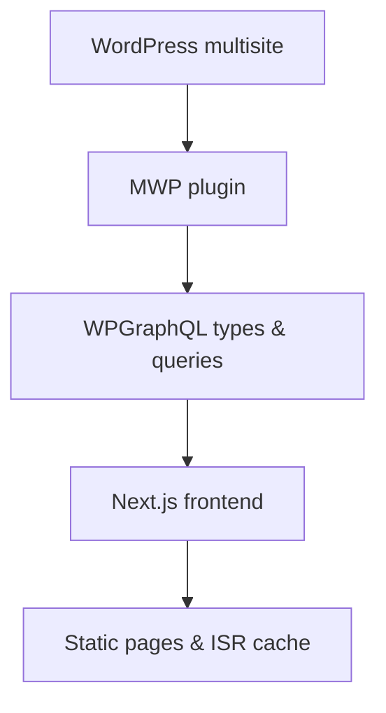

## High-level architecture

CCMS connects a WordPress multisite backend to a Next.js frontend through a stable GraphQL contract and an incremental static regeneration (ISR) pipeline.

Content and configuration live in WordPress. The MWP plugin shapes that data into a GraphQL schema. The frontend queries that schema to render pages, which Next.js serves statically and revalidates over time or on demand.

The rest of this page walks through each stage, how data flows, and what triggers updates.

## WordPress and MWP plugin responsibilities

WordPress is the source of truth for:

- Site content (pages, posts, custom content)
- Site configuration (navigation, feature flags, templates)
- Routing and redirects
- SEO metadata and robots behavior

The MWP plugin in `back/mwp` is the boundary layer between WordPress internals and everything downstream.

### GraphQL integration

`back/mwp/src/Graphql.php` extends the WPGraphQL schema with CCMS-specific types and queries, including:

- `mwpSettings` for site configuration
- `mwpRouting` and redirect resolver for routing and redirects
- `mwpSeo` for SEO metadata such as robots behavior and canonical URLs

These types define what the frontend is allowed to assume exists. They intentionally hide WordPress implementation details.

<Callout kind="alert">

GraphQL types and fields exposed by `back/mwp/src/Graphql.php` form a **contract** with the frontend queries in `front/app/lib/server/graphql`. Schema changes that remove or rename fields can break builds and revalidation if you do not update queries in lockstep.

</Callout>

### Revalidation integration

The MWP plugin also coordinates cache invalidation:

- `back/mwp/src/Revalidation.php` implements the core revalidation logic.
- `back/mwp/src/Admin/Pages/OnDemandRevalidation.php` exposes a WordPress admin page for manual on-demand revalidation triggers.

These components do not directly regenerate pages. Instead, they talk to the frontend revalidation API so Next.js can schedule ISR updates.

## GraphQL exposure and frontend consumption

The frontend accesses WordPress data only through GraphQL, never via direct database calls.

### Apollo client

`front/app/lib/server/graphql/apollo.ts` configures the Apollo client that talks to the WordPress GraphQL endpoint:

- Uses `process.env.WP_ENDPOINT` as the GraphQL URL.
- Authenticates with `WP_USER` and `WP_PASSWORD` via basic auth.
- Is instantiated in server-only contexts to keep credentials off the client.

All data access flows through this client, which centralizes:

- Endpoint and auth configuration
- Fetch policies and logging
- Error handling patterns

### GraphQL queries and fragments

The frontend organizes .gql documents under `front/app/lib/server/graphql/**`. Typical patterns include:

- Page-level queries for content and layout
- Shared fragments for `mwpSettings`, `mwpRouting`, and `mwpSeo`
- Specialized queries for preview mode and listing pages

These documents must stay in sync with the schema defined by `back/mwp/src/Graphql.php`. Any change in type names, field names, or required arguments should be reflected here.

<Callout kind="info">

Treat the .gql files in `front/app/lib/server/graphql/**` as the **single source of truth** for what the frontend expects from GraphQL. When you modify the schema, update these queries first, then ship both backend and frontend changes together.

</Callout>

## Frontend routing and preview

The Next.js frontend uses the App Router and a catch‑all route to turn GraphQL data into pages.

### Catch-all routing

The entry point for almost all site paths is:

- `front/app/[[...route]]/page.tsx` and related files under `front/app/[[...route]]/*`

This catch-all segment:

- Receives the requested `route` parameter (for example `["blog","my-article"]`).
- Uses Apollo client queries to call the WordPress GraphQL endpoint.
- Resolves content, routing, and SEO data through `mwpRouting`, `mwpSettings`, and `mwpSeo`.
- Decides whether to return a 200, redirect, or 404.

Redirects and routing decisions are driven by the data the MWP plugin exposes, not by hard-coded route maps.

### Preview mode

Preview mode allows content editors to see unpublished or draft content on the frontend:

- `front/app/api/preview/route.ts` exposes an API route that:
  - Authenticates and enables Next.js preview mode.
  - Stores preview tokens in cookies.
- The catch-all route under `front/app/[[...route]]`:
  - Detects preview mode.
  - Executes GraphQL queries in preview context (for example, querying drafts or bypassing cache).

From a flow perspective:

1. An editor clicks a preview link in WordPress.
2. WordPress opens the frontend preview URL, which hits `front/app/api/preview/route.ts`.
3. Preview mode is enabled, and the browser is redirected to a `[[...route]]` path.
4. The catch-all route queries GraphQL in preview context and renders draft content.

## Static generation, ISR, and caching

Next.js uses a mix of static generation and ISR to cache rendered pages and periodically refresh them.

### ISR configuration

Two key places configure caching behavior:

- `front/next.config.ts` sets HTTP caching headers for pages and assets and enables fetch logging for debugging.
- `front/app/lib/constants.ts` defines `NEXT_PUBLIC_REVALIDATE_STATIC` (default `300` seconds), which influences how often the frontend considers a page "stale" and eligible for regeneration.

The typical flow:

1. A request arrives at a path that has not been generated yet.
2. The catch-all route queries GraphQL and renders a response.
3. Next.js stores the generated HTML and data in its ISR cache.
4. Subsequent requests serve the cached version until:
   - The revalidation window (`NEXT_PUBLIC_REVALIDATE_STATIC`) expires, or
   - An on-demand revalidation trigger runs via `front/app/api/revalidate/route.ts`.

<Callout kind="info">

The system assumes **eventual consistency**. Content updates in WordPress do not instantly appear on the site. Instead, they propagate when:
- The ISR revalidation window elapses and a new request arrives, or
- A manual or automatic on-demand revalidation call hits `front/app/api/revalidate/route.ts`.

</Callout>

### Revalidation API route

`front/app/api/revalidate/route.ts` implements the frontend side of revalidation:

- Receives revalidation requests (typically from `back/mwp/src/Revalidation.php` or from tools that call it directly).
- Authenticates the caller (implementation-specific).
- Calls Next.js revalidation primitives for:
  - Specific paths
  - Tags or route groups (depending on implementation)

This is the bridge between a backend "content changed" signal and actual page regeneration in the ISR cache.

<Callout kind="alert">

If `front/app/api/revalidate/route.ts` is misconfigured or unreachable, content will **only** update when the standard ISR timeout elapses. For frequently changed content, this may cause editors to see stale pages longer than expected.

</Callout>

## Routing, redirects, and SEO metadata flow

Routing, redirects, and SEO metadata originate in WordPress and flow through GraphQL into the frontend rendering logic.

### Routing and redirects

Routing data flows as:

1. WordPress stores routing rules and redirect configuration (for example, custom slugs, path aliases, 301 redirects).
2. The MWP plugin exposes routing and redirect information via:
   - `mwpRouting` GraphQL types and fields
   - A redirect resolver that maps input paths to final destinations
3. The frontend catch-all route in `front/app/[[...route]]`:
   - Calls GraphQL with the requested path.
   - Inspects `mwpRouting` results to decide:
     - Render a page for a resolved node
     - Issue a redirect response (e.g. 301, 302)
     - Return 404 when routing has no match

Redirect behaviors (such as status codes, precedence rules, and wildcard handling) are implementation-dependent but must be consistent between backend configuration and frontend expectations.

### SEO metadata and robots behavior

SEO data flows as:

1. WordPress stores per-page and global SEO configuration.
2. `back/mwp/src/Graphql.php` exposes:
   - `mwpSeo` types for:
     - Canonical URL
     - Robots directives
     - Meta tags and open graph fields
   - `mwpSettings` for global SEO defaults
3. Page-level queries under `front/app/lib/server/graphql/**`:
   - Fetch `mwpSeo` fields along with content.
4. The catch-all route in `front/app/[[...route]]`:
   - Applies SEO metadata to the rendered page
   - Generates `<head>` tags, canonical links, and robots headers based on the query results

Operationally, SEO changes behave like content changes: they require revalidation or ISR expiry to propagate.

## Operational assumptions and coupling

The architecture relies on a few key assumptions that affect how you operate and evolve the system.

<Callout kind="info">

Core assumptions:
- The WordPress + MWP GraphQL schema is the **source of truth** for data shapes.
- The frontend's .gql queries are **strictly typed** against that schema and must remain compatible.
- Page content is **eventually consistent** due to ISR and revalidation windows.
- Revalidation routes are **reachable and authenticated** across environments.

</Callout>

### Contract stability between GraphQL and queries

The backend schema and frontend queries must evolve together.

Risks when the contract breaks:

- Removing or renaming a field in `back/mwp/src/Graphql.php` without updating .gql queries:
  - Causes query failures at runtime or during build.
  - Can result in 500s or blank pages for affected routes.
- Changing argument requirements or type nullability:
  - May require frontend changes to pass new arguments or handle missing data.

<Callout kind="alert">

Treat schema changes in `back/mwp/src/Graphql.php` as **breaking changes** unless you can prove all existing queries under `front/app/lib/server/graphql/**` still work. Always ship backend and frontend changes together, and ensure `front/app/api/revalidate/route.ts` is called to refresh affected pages after deployment.

</Callout>

### ISR delay and eventual consistency

Because of ISR:

- Editors might not see updates immediately after pressing publish or save.
- Pages update:
  - After `NEXT_PUBLIC_REVALIDATE_STATIC` seconds and a new request, or
  - When revalidation is explicitly triggered.

You should:

- Set `NEXT_PUBLIC_REVALIDATE_STATIC` in `front/app/lib/constants.ts` to balance freshness vs. load.
- Use on-demand revalidation for critical sections where stale content is unacceptable.
- Communicate realistic expectations to content teams about how long changes usually take to appear.

### CI/CD builds and full-site updates

CI/CD builds are another path for updates:

- When you deploy a new frontend build:
  - Next.js recomputes static pages that use build-time data fetching.
  - ISR caches may be reset depending on deployment strategy.
- When you deploy a new backend (WordPress/MWP):
  - Schema changes take effect for **all** subsequent queries.
  - Frontend must already be compatible with those changes before traffic shifts.

Plan deployments to avoid windows where:

- A new backend schema is live but the old frontend is still running incompatible queries.
- A new frontend expects fields the backend does not yet expose.

## Trace a change: content edit → site update

This walkthrough follows a typical page content edit through to a visible site change.

<Steps>

<Step title="Editor updates content in WordPress" icon="edit">

An editor changes a page or post in WordPress multisite and saves or publishes the change. WordPress stores the new content, but existing static pages and ISR cache entries still reflect the old version.

</Step>

<Step title="MWP plugin detects change and triggers revalidation" icon="alert-triangle">

`back/mwp/src/Revalidation.php` evaluates whether the change should trigger revalidation and, when configured, calls the frontend revalidation API at `front/app/api/revalidate/route.ts`. The exact detection logic is implementation-dependent, but the result is a "path or tag to revalidate" message sent to the frontend.

</Step>

<Step title="Frontend revalidation route schedules regeneration" icon="terminal">

`front/app/api/revalidate/route.ts` receives the request, authenticates it, and calls Next.js revalidation primitives for the affected path or tags. It does not immediately regenerate pages but marks them as stale for the next request.

</Step>

<Step title="Next request regenerates the page via GraphQL" icon="code">

The next time a user requests the affected path, the catch-all route in `front/app/[[...route]]` runs:
- Apollo client in `front/app/lib/server/graphql/apollo.ts` calls the WordPress GraphQL endpoint.
- Queries under `front/app/lib/server/graphql/**` fetch updated content and SEO data.
- Next.js renders the updated page and stores it back into the ISR cache.

At this point, users see the new content.

</Step>

</Steps>

If revalidation does not run, the same flow occurs after `NEXT_PUBLIC_REVALIDATE_STATIC` seconds when ISR naturally considers the page stale.

## Trace a change: routing/redirect change → site update

Routing and redirect changes follow a similar but routing-focused path.

<Steps>

<Step title="Admin updates routing or redirects in WordPress" icon="settings">

An administrator changes a slug, custom route, or redirect rule in WordPress. The new routing configuration is saved but does not immediately change existing ISR cache entries.

</Step>

<Step title="MWP exposes new routing via mwpRouting" icon="database">

`back/mwp/src/Graphql.php` already exposes routing data through `mwpRouting` and the redirect resolver. Once the WordPress update is stored, subsequent GraphQL queries will see the new routing rules and target nodes.

</Step>

<Step title="Revalidation marks affected paths as stale" icon="alert-triangle">

`back/mwp/src/Revalidation.php` determines which paths or route groups are impacted (implementation-dependent) and sends revalidation requests to `front/app/api/revalidate/route.ts`. The frontend marks those paths as stale so the next request will re-run routing logic.

</Step>

<Step title="Next request resolves routing in catch-all route" icon="code">

When a user requests an affected path:
- The catch-all route in `front/app/[[...route]]` queries GraphQL for routing and redirects via `mwpRouting`.
- The route handler:
  - Issues a redirect if rules now say so.
  - Resolves the content node for a new slug or alias.
  - Returns 404 if the route no longer resolves.

Next.js caches this new routing decision and resulting page in the ISR cache.

</Step>

</Steps>

If manual revalidation does not occur, updates will still propagate once the ISR timeout is reached and a new request hits the path.

## Trace a change: template code change → site update

Template and code changes are driven by deployments, not by WordPress revalidation.

<Steps>

<Step title="Developer updates frontend templates" icon="code">

A developer edits components and route handlers in the frontend, for example under:
- `front/app/[[...route]]/*` for core page rendering
- Shared layout, SEO, or component files that consume `mwpSettings`, `mwpRouting`, or `mwpSeo`

These changes alter how existing GraphQL data is rendered, but not the data itself.

</Step>

<Step title="CI/CD builds a new frontend artifact" icon="package">

The CI/CD pipeline runs a new build:
- Next.js compiles the updated code.
- Static generation runs for pages that use build-time data fetching.
- ISR configuration and tags remain aligned with the environment configuration.

If the build includes updated .gql documents under `front/app/lib/server/graphql/**`, it must match the live schema from `back/mwp/src/Graphql.php`.

</Step>

<Step title="Deployment replaces the running frontend" icon="rocket">

The new build is deployed. Depending on your hosting setup:
- Existing ISR caches may be cleared or migrated.
- New requests begin using the updated route handlers and components in `front/app/[[...route]]/*`.

Even with the same GraphQL responses, pages now render with the updated templates.

</Step>

<Step title="Optional revalidation for critical routes" icon="alert-triangle">

If the code change affects critical pages (for example navigation, SEO rendering, or layout across all routes), you may:
- Call `front/app/api/revalidate/route.ts` for specific paths or global tags, or
- Rely on standard ISR expiry (`NEXT_PUBLIC_REVALIDATE_STATIC`) to roll out changes gradually.

This ensures cached pages reflect the new templates without waiting for organic timeout where necessary.

</Step>

</Steps>

<Callout kind="alert">

Deployments that update .gql queries without compatible updates to `back/mwp/src/Graphql.php` (or vice versa) can cause runtime failures even if revalidation and ISR behave correctly. Always validate schema compatibility before rolling out.

</Callout>

## Summary and next steps

The CCMS architecture hinges on a clear separation of concerns:

- WordPress + MWP define **data and configuration** through GraphQL.
- The Next.js frontend consumes that data via **typed queries** and handles **routing, SEO, and rendering**.
- ISR and revalidation bridge **content changes** and **live site updates** with controlled eventual consistency.

When working on this system, always think in terms of:

- **Where** the data originates (WordPress).
- **How** it is shaped and exposed (MWP GraphQL and types like `mwpSettings`, `mwpRouting`, `mwpSeo`).
- **When** caches are refreshed (ISR timeout vs. `front/app/api/revalidate/route.ts` triggers).
- **Which** contract changes require coordinated backend and frontend deployments.